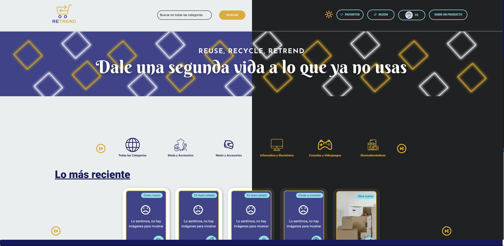
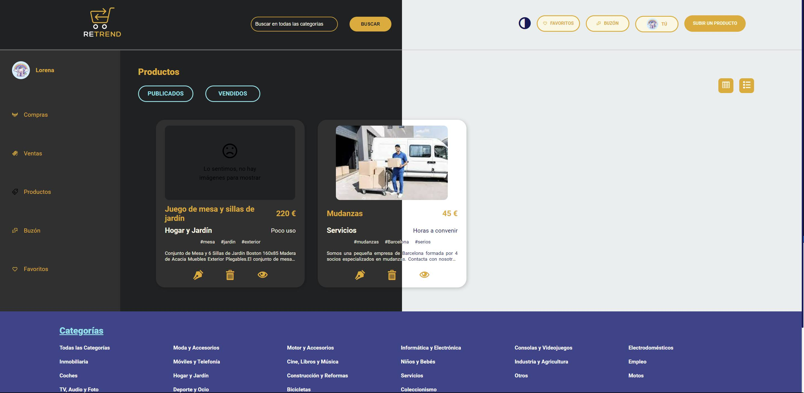
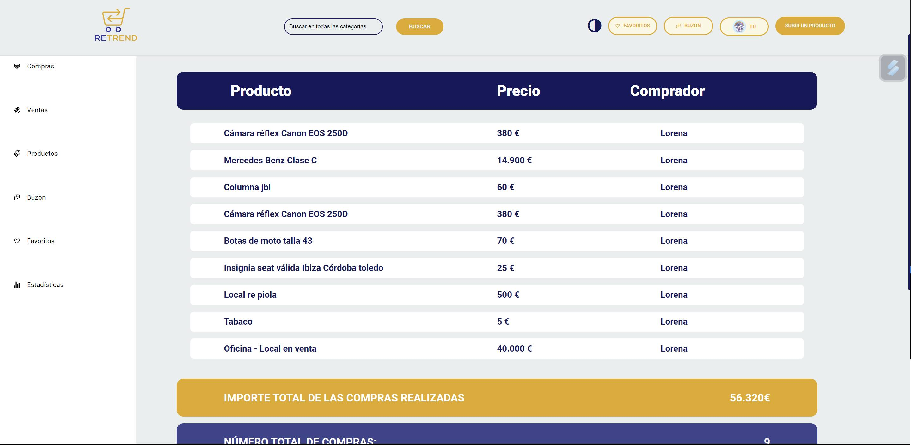
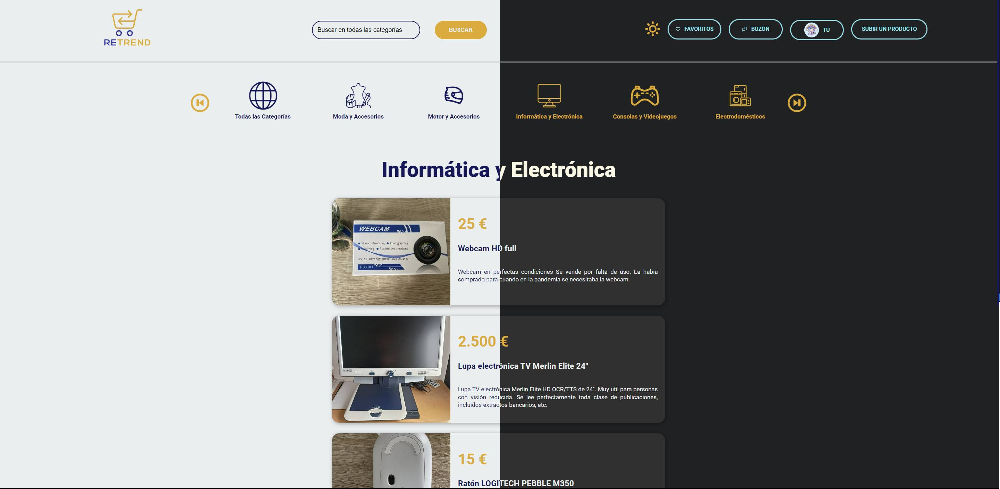
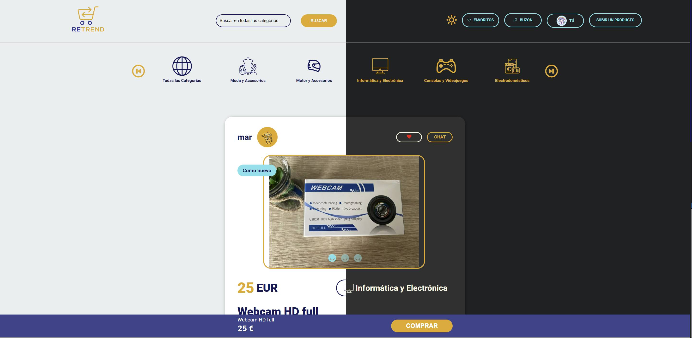
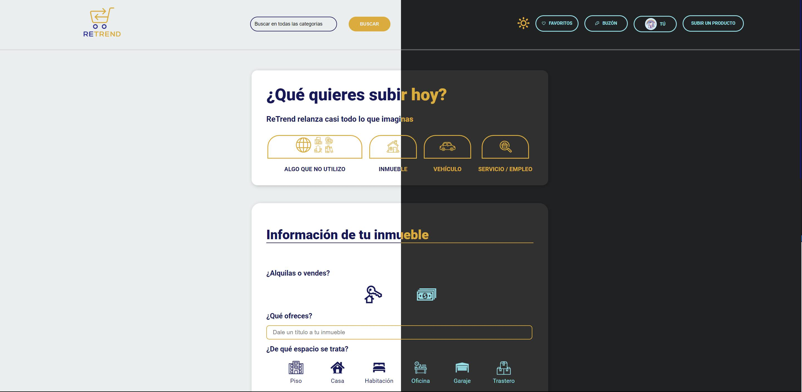
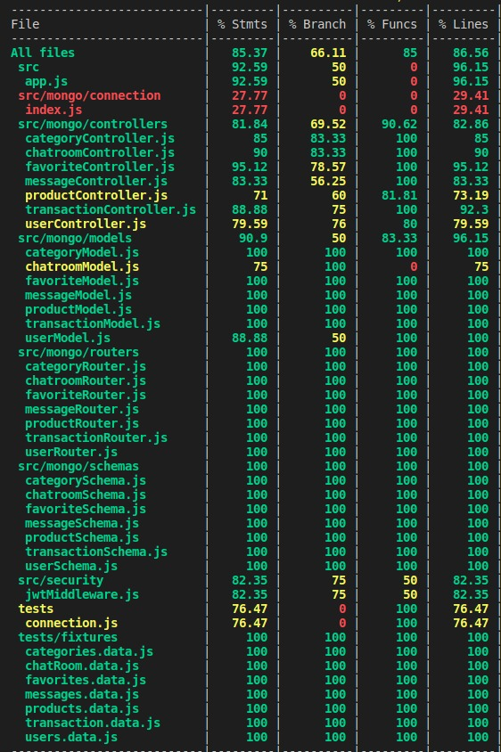

# ReTrend
ReTrend es un ecommerce en formato aplicación web desarrollado como proyecto final del Bootcamp de Nuclio Digital School de la promoción de Junio de 2023 y resultado del trabajo de varios alumnos que iniciaron el máster con pocos o ningún conocimiento sobre programación.
## Tabla de contenidos
1. Descripción del proyecto
2. Recorrido por la plataforma
3. Tecnologías utilizadas
4. Instalación
6. Responsables del proyecto
   
# Descripción del proyecto
ReTrend es un clon personalizado del ecommerce Wallapop que permite la compra-venta de productos de segunda mano entre usuarios registrados en la plataforma. La aplicación permite una navegación libre entre las diferentes categorías, visualización de productos y sus relacionados, enviar la ficha de producto a un amigo o familiar… Sin embargo, está diseñada para que ciertas funcionalidades sólo las puedan llevar a cabo los usuarios logueados en la aplicación, así como chatear, marcar productos como favoritos, publicar productos o realizar transacciones entre usuarios.

Como punto de partida se establecieron las diferentes entidades de las que constaba la plataforma y la relación que se iba a establecer entre ellas para así poder crear toda la lógica de programación de la aplicación, tal y como muestra la siguiente figura:


# Recorrido por la plataforma
### Home Page
Bajo la premisa “Dale una segunda vida a lo que ya no usas”, ReTrend ofrece al usuario una barra de navegación por las distintas categorías y una visita rápida por las novedades de la plataforma: los productos más recientes, los más destacados por categoría según estacionalidad… así como información adicional sobre ReTrend Pro, la app móvil y enlaces a soporte, política de privacidad o funcionamiento de la plataforma.

Para una fácil navegación, en la parte superior (Navbar) se presenta el icono de ReTrend para volver rápida y fácilmente a la Home, un buscador por palabras, además de los enlaces al Login y al Register. Una vez logueado, tendrá rápido acceso a su perfil, favoritos y buzón de mensajes. 

La aplicación se presenta en modo light, pero si el usuario lo desea, puede cambiar a modo oscuro haciendo click en el icono correspondiente.



### Login / Register Page
En la página de Register, el usuario deberá cumplimentar un breve formulario para darse de alta en la plataforma y, empezar así, a disfrutar de las funcionalidades exclusivas de ReTrend. Puede cargar una imagen de perfil o hacerlo más tarde desde su perfil, donde también podrá editar sus datos personales.

En la página de Login, tan sólo es necesario introducir el mail del registro y la contraseña, ambos validados desde backend para evitar duplicación de usuarios.


### User Profile
La página de usuario consta de distintas secciones:

* Perfil. Donde editar los datos personales y cambiar la foto del usuario.
  
  

* Compras. Donde visualizar los productos comprados en formato grid o lista. Muestra el título, imagen, precio y nombre del vendedor del producto.
  
  

* Ventas. Donde visualizar los productos comprados en formato grid o lista. Muestra una breve ficha del producto.
  
  

* Productos. Donde visualizar todos los productos que el usuario ha subido a ReTrend. Muestra una breve ficha del producto en formato grid o lista, desde donde podrá editarlo (tanto la información como las imágenes), borrarlo o navegar a la ficha completa para visualizarla.
  
  
  

* Buzón. Donde visualizar los chats mantenidos con otros usuarios. Muestra el último chat más reciente, así como un histórico filtrado por producto.
  


* Favoritos. Donde visualizar todos los productos marcados como favoritos por el usuario en formato grid o lista. Muestra una breve ficha de cada uno, desde donde podrá desmarcarlo como favorito, navegar a la ficha completa para visualizarlo o comprar ya dicho producto.


* Estadísticas. Donde visualizar de forma rápida las compras y ventas del usuario, así como el importe total, el número de transacciones realizadas y el importe promedio de cada una de ellas.
  



### Categories Page
Desde la Home Page el usuario puede navegar entre las distintas categorías de productos que ofrece la aplicación. Un primer icono permite ver todos los productos perteneciente a cualquier categoría y los demás, filtrados según la propia. Desde aquí, las cards, muestran los principales datos de los productos y permiten la navegación a su ficha.

La paginación está realizada desde backend, para que cada vez que el usuario pulse el botón de “Mostrar más” se haga una nueva petición para enviar un número limitado de productos y no saturar así el servidor.





### Product Page
La página de producto presenta la ficha de especificaciones técnicas del mismo: el vendedor, estado del producto, imágenes en formato slider ampliables en un modal, precio, keywords, categoría a la que pertenece, una descripción desplegable e iconos para compartirla por redes sociales.

El usuario logueado podrá añadir este producto a su lista de favoritos, chatear con el vendedor para consultar dudas e incluso comprarlo directamente desde el botón de compra situado en la barra inferior.

Para una mayor experiencia de usuario, podrá visualizar productos relacionados con el que tenga en pantalla, filtrados según la categoría.




### Form Page
Para subir un nuevo producto a ReTrend, el usuario podrá elegir entre cuatro grandes grupos: “Inmueble”, “Vehículo”,  “Servicio/Empleo” y “Algo que no utilizo” donde se engloban el resto de productos.

Haciendo click en cada uno de ellos se abrirá un formulario distinto, según los requerimientos de cada grupo, donde podrá rellenar los campos principales, algunos de ellos obligatorios con validación, y podrá subir imágenes del producto, usando un widget de Cloudinary.



### Chat
El chat es el canal de comunicación por excelencia entre usuarios de ReTrend. La vía perfecta para resolver dudas sobre algún producto o incluso negociar un poco el precio. 

Está realizado con WebSockets, un protocolo de comunicación ampliamente compatible con los navegadores web modernos que permite la comunicación bidireccional en tiempo real entre un cliente (normalmente un navegador web) y un servidor. Proporciona canales de comunicación eficientes, de baja latencia y full-duplex a través de una única conexión TCP. 

# Testing
Para testear el correcto funcionamiento de la aplicación hemos utilizado dos herramientas:
* Jest, para realizar pruebas unitarias y de integración, incluyendo pruebas de funciones, componentes y módulos individuales. Proporciona una amplia gama de funcionalidades, como aserciones, cobertura de código, ejecución paralela de pruebas y mocks para simular dependencias externas.

La siguiente figura muestra un 85% de cobertura de código en la aplicación de ReTrend, obtenido mediante los tests programados.



* Cypress, para realizar pruebas end-to-end de toda la aplicación en un navegador. Cypress interactúa directamente con la aplicación, permitiendo probar acciones del usuario y verificar el estado de la interfaz en tiempo real.

# Tecnologías utilizadas
### Principales librerías utilizadas en Front-End:
* React
* React-Router-Dom
* React-Hook-Form 
* React-Query
* Axios
* Jest (testing)
### Principales librerías utilizadas en Back-End:
* Express
* Mongoose (Base de datos)
* Socket.io (Cliente y servidor)
* Cloudinary (Gestión de imágenes)
* JWT (Autenticación y autorización)
* Cypress (testing)

# Instalación

## 1. Requisitos previos

Para ejecutar ReTrend en local, debes tener instalado:
* Node.js
* MongoDB

## 2. Configuración:

* Clona este monorepositorio en tu máquina local:
````
$ git clone https://github.com/nds-fsd/wallapop.git
````
* Instala las dependencias del proyecto:
```
$ npm install
````
* Crea un archivo .env en la raíz del proyecto y agrega las siguientes variables de entorno:
```
PORT: 3001
MONGO_URL: [ ]
JWT_SECRET: [ ]
VITE_CLOUD_NAME: [ ]
````
* Inicia el servidor y el cliente:
```
$ npm run dev
````
* Abre el navegador web en el siguiente puerto para visualizar la aplicación:
```
http://localhost:3000/
```
# Responsables del proyecto
* Mar Badia
* Lorena Carmona
* Luciano Churio

